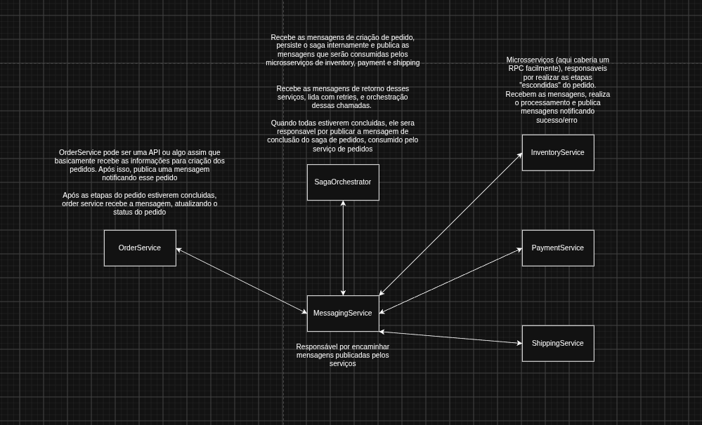

# Saga Pattern

Este repositório registra meu estudo do padrão Saga em Go. O objetivo
não é entender como executar, compensar e persistir um fluxo distribuído.

## Caminho do estudo

O estudo foi mantido em etapas:

1. Na branch `v1`, o caso de uso de criação do pedido executa as operações e
   registra seus rollbacks. Quando uma operação falha, as anteriores são
   desfeitas em ordem inversa.
2. Na branch `v2`, cada step passou a conhecer sua execução e sua compensação.
   Também experimentei abstrair a Saga para reutilizá-la em diferentes casos de
   uso.
3. Na `main`, os domínios passaram a rodar como serviços separados. A comunicação
   é assíncrona com Google Pub/Sub, e o estado da Saga é persistido em SQLite.

Essa evolução ajudou a sair de uma Saga em memória, dentro de uma única
aplicação, para um cenário mais próximo de um sistema distribuído.

Na implementação atual, o foco está em `order`, `saga` e `messaging`. Inventory,
Payment e Shipping são propositalmente simples: existem apenas para executar os
steps e permitir testar sucesso, falha e compensação.

## Diagrama



O `MessagingService` do diagrama representa o broker de mensagens. Na
implementação, esse papel é exercido pelo emulador local do Google Pub/Sub.

O fluxo principal é:

1. Order Service cria o pedido e publica uma mensagem.
2. Saga Orchestrator recebe a mensagem e persiste a Saga.
3. O orquestrador publica os comandos de cada fase.
4. Inventory, Payment e Shipping processam os comandos e publicam seus
   resultados.
5. O orquestrador avança a Saga ou inicia as compensações quando ocorre uma
   falha.
6. Ao concluir, publica o resultado para que Order Service atualize o pedido.

## Estrutura atual

```text
cmd/        executáveis dos serviços e do orquestrador
internal/   regras de cada serviço e da Saga
pkg/        contratos e componentes compartilhados de mensageria
test/e2e/   cenários de sucesso e falha
```

## Executando

Suba os serviços e o emulador:

```bash
docker compose up -d --build
```

Execute os testes E2E:

```bash
docker compose --profile test run --rm e2e
```

Os testes simulam o fluxo completo e falhas em Inventory, Payment e Shipping
para validar as compensações. O projeto também possui configurações em
`.vscode` para executar esses cenários com o debugger.
